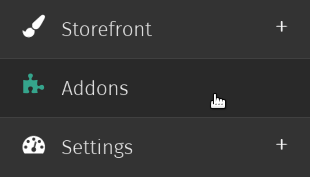
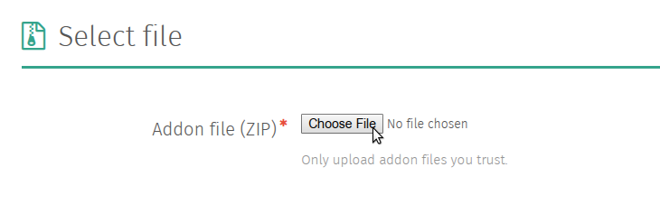
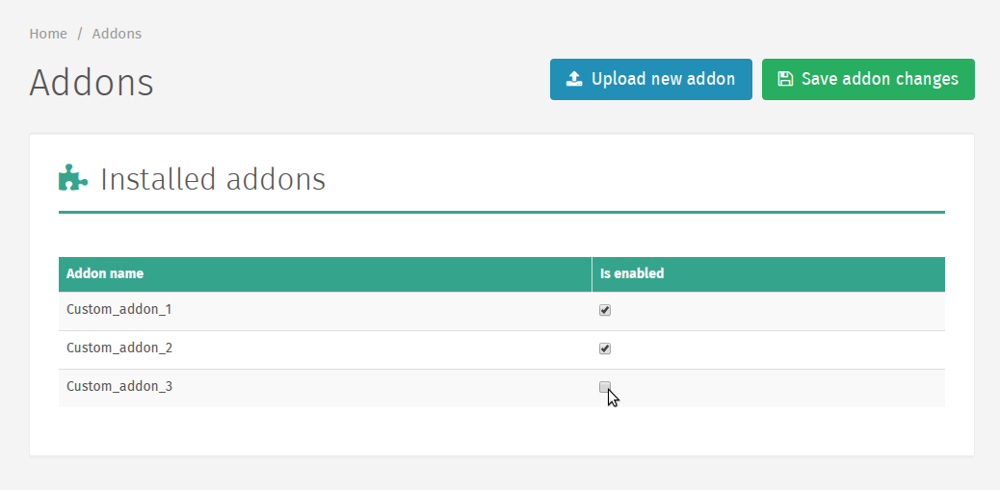

.. _Addons:

Addonit
=======

Installing Addons
~~~~~~~~~~~~~~~~~

.. note::
   Uploading addons is currently disabled in the Cloud version of
   Shuup.

Addons are installed through the Addons admin. To navigate to the
Addons admin, select `Addons` from the Shuup Admin menu.

Any installed addons will be listed on this page.

To upload an addon, click `Upload new addon` on the Addon toolbar.

.. note::
   Addons must be uploaded in .zip format

Next, upload the addon by selecting the .zip file with your file
selector and clicking the `Upload` button.

Once the file has been uploaded, you will be able to view any package
information as well as a list of the uploaded file contents.

Next, click `Install Addon` to install the addon. This will take you to
a page stating whether or not the installation was successful, and if
it was unsuccessful it will display more information about the error.

.. tip::
   When troubleshooting installation issues, it helps to copy and paste
   the error/traceback information.

You should be taken back to the Addon admin page, and unless there were
problems uploading your file it should be included in the list of
installed addons. However, it will not yet be enabled.

Lisäosien asettaminen käytössä-tilaan
~~~~~~~~~~~~~~~~~~~~~~~~~~~~~~~~~~~~~

Kun lisäosa on asennettu, se tulee asettaa `Käytössä`-tilaan Lisäosat-
ylläpitosivulla. Ottaaksesi lisäosan käyttöön, rastita ruutu `Käytössä`-
sarakkeessa kyseessä olevan lisäosan nimen kohdalla ja valitse `Tallenna
lisäosien muutokset` sivun työkalupalkista.

Jos lisäosien listaan tehdään muutoksia niiden `Käytössä`-sarakkeessa,
palvelin on päivitettävä sivun työkalupalkkiin ilmestyvästä `Päivitä
sovellus`-painikkeesta.

.. warning::
   Sovelluksen palvelimen päivittäminen saattaa aiheuttaa viiveen ennen
   kuin sovellus käynnistyy uudestaan.

   Lisäksi, on pieni mahdollisuus, että sovellus ei käynnisty oikein
   ollenkaan päivittämisen jälkeen, jolloin on suoritettava vianmääritys
   ja mahdollisesti otettava yhteyttä järjestelmän ylläpitäjään.

Klikattuasi `Päivitä sovellus` –painiketta sinut ohjataan Sovelluksen
palvelimen päivitys –sivulle, missä palvelin voidaan päivittää
`Päivitä sovelluksen palvelin` –painikkeesta.
