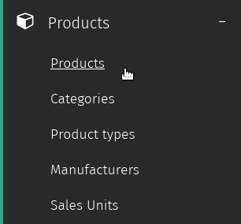
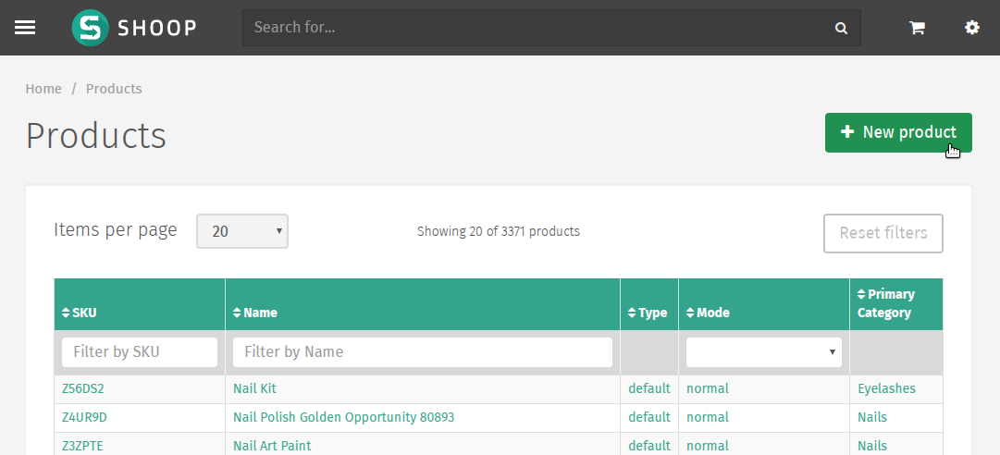
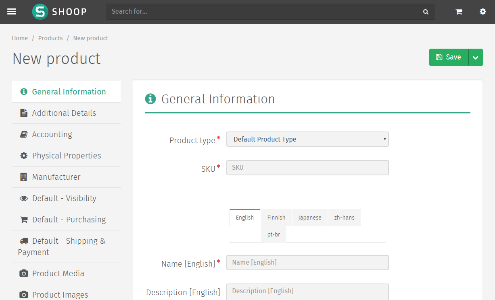
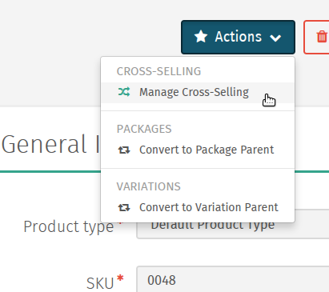
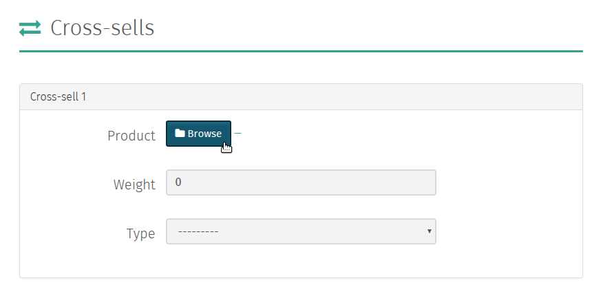
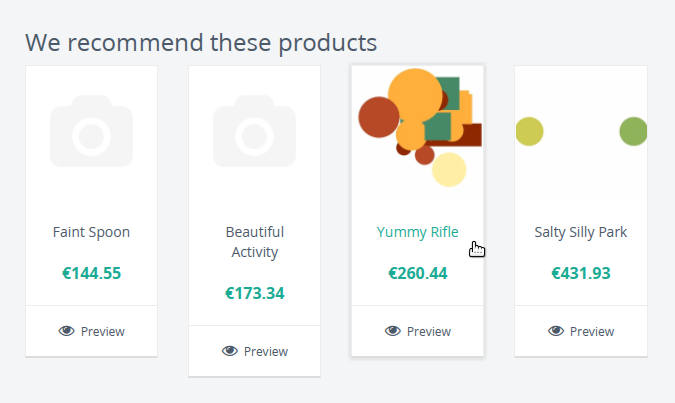
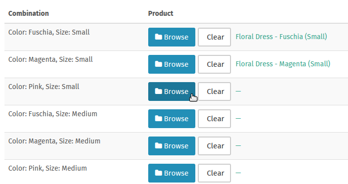

Tuotteet
========

Tuotteiden lisääminen
---------------------

Shuup hallintapaneeli tarjoaa helppokäyttöisen käyttöliittymän
tuotteiden lisäämiseen verkkokauppaasi.

Päästäksesi Shuup hallintapaneelin Tuotteet-osioon, valitse
hallintapaneelin valikosta kategoria `Tuotteet` ja alle aukeavasta
alavalikosta osio `Tuotteet`.

`Tuotteet`-sivulta löydät listan kaikista kaupassasi olevista
tuotteista. Osion oikeasta yläkulmasta löydät painikkeen `Uusi tuote`.

Uusi tuote –lomake
~~~~~~~~~~~~~~~~~~

Valitsemalla `Uusi tuote` pääset `Uusi tuote` –lomakkeeseen, mihin
uuden lisättävän tuotteen tiedot syötetään.

Kuten muissakin Shoop hallintapaneelin lomakkeissa, pakolliset
kentät on merkitty punaisella tähdellä ja puuttuvat tai virheellisen
tiedon sisältävät kentät korostetaan punaisella lomakkeen
tallentamisen yhteydessä.

Lomakkeen vasemmassa laidassa on valikko, jossa olevat valinnat
ohjaavat lomakkeen eri välilehtiin ja avaa tuotteen eri
ominaisuuksien määrittämiseen tarvittavat kentät.

Perustietovälilehdet
^^^^^^^^^^^^^^^^^^^^

`Uusi tuote` –lomakkeen vasemman laidan valikon ylin välilehti
sisältää kentät tuotteen perustietojen syöttämiseen.

Yleiset tiedot
    Tuotteen yleiset tiedot, kuten tuotteen tyyppi, nimi ja
    tuotteen kuvaus.
Lisätietoja
    Lisätietoja tuotteesta, kuten tuotteen varastotiedot,
    toimitustavat, viivakoodin tiedot ja hakutermit.
Kirjanpito
    Kirjanpitoon liittyvät tiedot.
Fyysiset ominaisuudet
    Tuotteen mitat ja yksikkötiedot.
Valmistaja
    Tuotteen valmistajan valinta.

Kauppakohtaiset välilehdet
^^^^^^^^^^^^^^^^^^^^^^^^^^

Perustietojen alla olevat valikon välilehdet koskevat tuotteen
kauppakohtaisten tietojen määrittämistä. Välilehtien nimet alkavat
kyseessä olevan kaupan nimellä (aluksi: *Oletus*).

Näkyvyys
    Kauppakohtaiset tuotteen näkyvyysasetukset front-end –puolella.
Ostaminen
    Hinnoittelu-, toimittaja- ja moniostoasetukset.
Toimitukset & Maksaminen
    Toimitus- ja maksupalveluihin liittyvät asetukset (mahdollistaa
    asiakkaalle tarjottavien toimitus- ja maksutapavaihtoehtojen
    rajaamisen).

Mediavälilehdet
^^^^^^^^^^^^^^^

Näissä osioissa voidaan määrittää tuotteeseen liittyvä kuva- ja
mediasisältö.

Tuotemedia
    Upload-työkalu ja valitsin tuotteeseen liittyvälle medialle.
Tuotekuvat
    Upload-työkalu ja valitsin tuotekuville.

.. tip::
    Tarkennetut tuotemedia-asetukset mahdollistavat ladattavan
    digitaalisen sisällön tarjoamisen verkkokaupassasi.

Asiakasryhmäkohtaisen hinnoittelun välilehti
^^^^^^^^^^^^^^^^^^^^^^^^^^^^^^^^^^^^^^^^^^^^

Hinnoittelun määrittäminen asiakasryhmäkohtaisesti. Jos asiakas
kuuluu useaan ryhmään, hänelle näytetään eri ryhmille määritetyistä
hinnoista alin.

.. note::
   Asiakaskohtainen hinnoittelu ei toistaiseksi ole mahdollista
   kauppakohtaisesti.

Tallennettu Uusi tuote –lomake
~~~~~~~~~~~~~~~~~~~~~~~~~~~~~~

Kun tuote on onnistuneesti tallennettu, tuotetietolomakkeeseen
aukeaa lisää tuotteeseen liittyviä valintoja.

Attribuutit-välilehti
^^^^^^^^^^^^^^^^^^^^^

Katso Attribuutit_.

Varastonhallinta-välilehti
^^^^^^^^^^^^^^^^^^^^^^^^^^

Varastossa olevalle tuotteelle tulisi täällä olla saatavilla
kaikki tarvittavat varaston hallintaan liittyvät valinnat
riippuen tuotteen toimittajaan liittyvistä asetuksista.

.. todo:: Add complete reference for product fields

Tilaukset -välilehti
^^^^^^^^^^^^^^^^^^^^

Näytä viimeisimmät tilaukset jotka sisältävät tätä tuotetta.

Tuotetyypit
-----------

Tuotetyypit määrittävät tuoteluokat ja niitä käytetään yhdistämään
eri `attribuuttijoukkoja <attribuutit>`_ tiettyihin tuotteisiin
tuotetyypin perusteella.

Esimerkiksi tuotetyyppi *Kirja* saattaa tarvita sille ominaisia
tietoja, kuten kirjailija, ISBN, julkaisija ja niin edelleen.
Vastaavasti tuotetyyppi *Vaate* saattaa tarvita tiedot koko,
väri ja muita vain tälle tuotetyypille ominaisia attribuutteja.

Attribuutit
-----------

Kaupan omistaja voi määritellä tarvitsemansa attribuutit
`tuotetyypeille <Tuotetyypit>`_ hallintapaneelin Attribuutit-kategoriasta.

1. Valitse `Attribuutit`-kategoria Shuup hallintapaneelin valikosta
2. Valitse `Uusi attribuutti` näkymän oikeasta yläkulmasta
3. Syötä nimi ja **yksilöllinen** tunniste attribuutille ja valitse
   attribuutille tyyppi, näkyvyystila, ja haettavuus
4. Siirry `Tuotetyyppi`-sivulle (`Tuotteet`-kategoriassa) Shuup
   hallintapaneelin valikossa
5. Valitse taulukosta tuotetyyppi
6. Valitse `Attribuutit`-välilehti ja klikkaa rasti luomasi uuden
   attribuutin nimen vieressä olevaan ruutuun

.. tip::
   Oletuksena uudet attribuutit näytetään tuotesivulla, mutta tätä
   voidaan muuttaa useilla eri näkyvyysvalinnoilla attribuuttien
   muokkaussivulla.

Ristiinmyynti
-------------

Ristiinmyyntien lisääminen
~~~~~~~~~~~~~~~~~~~~~~~~~~

Toisiinsa liittyviä tuotteita voidaan myydä yhdessä Shuup-verkkokaupassa
käyttämällä Shuupin ristiinmyyntiominaisuutta. Ristiinmyyntisuhteita
voidaan hallita Shuupin Tuotteet-ylläpidossa.

Lisätäksesi ristiinmyyntisuhteen tuotteellesi, siirry tuotteen
muokkaussivulle ja valitse `Hallinnoi ristiinmyyntiä` `Toiminnot`-valikosta.

Tuotteet valitaan klikkaamalla `Hae`-painiketta ja valitsemalla
haluttu tuote tuotelistalta.

Kun tuote on valittu, ristiinmyyntisuhteen paino voidaan asettaa.

Ristiinmyyntisuhteen painoa käytetään kun lasketaan mitkä tuotteet
näytetään verkkokaupassa yhdessä. Mitä suurempi arvo annetaan
ristiinmyyntisuhteen painolle, sitä suuremmalla todennäköisyydellä
valitut tuotteet näytetään yhdessä.

Lopuksi voit valita yhden seuraavista ristiinmyyntisuhteen tyypeistä:

Suositeltu
    Tuotteita suositellaan yhdessä ostettavaksi.
Toisiinsa liittyvät
    Tuotteet liittyvät toisiinsa.
Laskettu
    Suunniteltu ensisijaisesti verkkokaupan lisäosien kautta
    käytettäväksi.
Ostettu samalla
    Suunniteltu ensisijaisesti sisäiseen käyttöön. Nämä
    ristiinmyyntisuhteet lasketaan automaattisten Shuup taskien
    avulla. Jos palvelimen ylläpitäjä ei ole määrittänyt näitä
    taskeja, ne voidaan määrittää manuaalisesti täällä.

.. note::
    Enimmillään viisi ristiinmyyntisuhdetta voidaan määrittää
    kerralla. Useampia ristiinmyyntisuhteita voidaan kuitenkin
    määrittää, kun ensimmäiset suhteet on tallennettu. Tämä
    voidaan tarvittaessa toistaa.

Ristiinmyyntien näkyvyys
~~~~~~~~~~~~~~~~~~~~~~~~

Kun ristiinmyyntisuhteet on määritetty tuoteasetuksissa,
ristiinmyynnit saadaan näkyviin verkkokaupassa käyttäen Xtheme
Cross-Sells –liitännäistä.

Tee seuraavat toimenpiteet saadaksesi ristiinmyyntisuhteen
näkyviin verkkokaupassasi:

1. Varmista, että olet kirjautunut kauppaasi ylläpitäjänä ja
   siirry verkkokauppasi etusivulle.
2. Siirry verkkokaupassasi mille tahansa tuotesivulle.
3. Valitse `Muokkaa Sivua` sivun oikeasta alalaidasta.
4. Valitse yksi Xtheme placeholder –laatikoista.
5. Lisää uusi rivi tai sarake liitännäisellesi.
6. Valitse `Tuotteiden ristiinmyynnit` liitännäisen pudotusvalikosta.
7. Lisää halutessasi otsikko, valitse ristiinmyyntisuhteen tyyppi
   ja valitse kerralla näytettävien tuotteiden määrä. Voit myös
   valita, haluatko näyttää vai piilottaa tuotteet, joita ei ole
   varastossa tai jotka eivät muutoin ole tilattavissa.
8. Tallenna liitännäinen.
9. Julkaise muutokset.
10. Klikkaa `Poistu muokkauksesta` -painiketta sivun oikeasta alalaidasta.
11. Ristiinmyytävien tuotteittesi pitäisi nyt tulla näkyviin tuotesivulla.

.. The page will now enter an editable draft mode and depending on the
   theme template settings, dashed Xtheme placeholder boxes should become
   visible on the page. These may be empty boxes by default.

.. note::
   Ristiinmyyntisuhteet ovat yksisuuntaisia ja suhde tulee manuaalisesti
   lisätä ristiinmyytäviin tuotteisiin, jotka haluat saada näyttämään
   alkuperäisen tuotteen omana ristiinmyyntituotteenaan.

.. note::
   Jos tuotteelle ei ole määritetty valitun tyypin ristiinmyyntisuhteita,
   liitännäinen ei ole näkyvissä tuotesivulla.

Pakettituotteet
---------------

Package products are used to package a number of related products to be
sold as a single product package.

These products are stored a single package *parent*, which can be
linked to multiple package *children*.

Stock for child products is automatically updated when the package is
purchased. Pricing, discounts, etc, of the parent product can be
managed like any other product.

To convert a product to a package parent:

1. Navigate to the parent product's edit page and select `Convert to
   Package Parent` from the `Actions` dropdown menu.

   .. image:: products/convert-to-package-parent-dropdown.png

2. Click the `Browse` button to add child products to the package.
   Enter the quantity of each product to include in the package.

   .. image:: products/package-products-form.png

3. Click `Save` to save the package's child product informatino.

Variaatiotuotteet
-----------------

Joitakin tuotteita saatetaan haluta tarjota asiakkaille useana eri
variaationa ja asiakkaan tulee pystyä tekemään valinta eri
vaihtoehtojen välillä lisätessään tuotteen ostoskoriin.

Shuup mahdollistaa kaksi erilaista tuotevariaatiotyyppiä;
yksinkertaiset variaatiot ja muuttujavariaatiot.

Yksinkertaiset variaatiot
~~~~~~~~~~~~~~~~~~~~~~~~~

Yksinkertaiset variaatiot ovat yleisiä variaatioita, jotka näytetään
tuotesivulla yksinkertaisena pudotusvalikkona, josta asiakas
voi valita haluamansa variaatiotuotteen.

Muuttujavariaatiot
~~~~~~~~~~~~~~~~~~

Muuttujavariaatiot mahdollistavat ”lapsituotteen” määrittämisen eri
muuttujien avulla. Tuotteesi saattaa tarvita esimerkiksi muuttujat
`koko` ja `väri`, joista kummallekin on useita mahdollisia arvoja
ja asiakkaan on pystyttävä valitsemaan näille mikä tahansa
mahdollinen yhdistelmä.

Lisätäksesi muuttujavariaatioita:

1. Siirry tuotteen muokkaussivulle ja valitse
   `Muunna variaatioisännäksi` `Toiminnot`-valikosta
2. Valitse `Muuttujat` vasemman reunan valikosta
3. Valitse `Lisää uusi muuttuja` lisätäksesi uuden muuttujalomakkeen
4. Anna muuttujalle nimi
5. Valitse `Lisää uusi arvo`
6. Anna nimet mahdollisille arvoille
7. Jatka muihin muuttujiin/arvoihin tarpeen mukaan
8. Kun valmista, tallenna valinnat työkalupalkin painikkeesta

Kun muuttujat on lisätty, ”lapsituotteet” voidaan linkittää kaikille
muuttujien yhdistelmille. Esimerkiksi 3 `koko`-muuttujan arvoa ja 2
`väri`-muuttujan arvoa eri yhdistelmineen muodostaa 6 mahdollista
”lapsituotetta”.

.. tip::
   Lapsituotteiden nimien tulisi noudattaa johdonmukaista kaavaa,
   joka osoittaa muuttujan arvon jokaiselle tuotteelle.

.. tip::
   Muuttujavariaatiot voidaan muuttaa yksinkertaisiksi variaatioiksi
   valitsemalla `Konvertoi yksinkertaiseksi muuttujaksi`
   Variaatio-näkymän työkalupalkista. Huomioi kuitenkin, että näin
   tehtäessä kaikki asetetut muuttujat ja arvot menetetään.

Variaatioiden hallinta
~~~~~~~~~~~~~~~~~~~~~~

Kun tuote on muunnettu ”variaatioisännäksi” (yksinkertainen variaatio
tai muuttujavariaatio), sen ominaisuuksia voidaan hallita valitsemalla
`Hallitse variaatioita` `Toiminnot`-valikosta ”variaatioisännän”
ylläpitosivulta tai minkä tahansa ”lapsituotevariaation” ylläpitosivulta.
